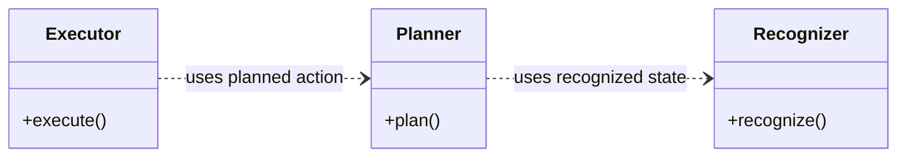

# Class Diagram 작성 가이드

이 가이드는 시스템의 전체 구조 또는 특정 모듈의 내부 구조를 Mermaid UML class
diagram으로 표현할 때 적용한다. 목적은 구현 세부사항을 확정하는 것이 아니라, 현재
설계에서 중요한 책임과 관계를 빠르게 이해할 수 있게 만드는 것이다.

## 1. 다이어그램의 수준을 먼저 정한다

### 전체 구조도

- 시스템의 핵심 책임을 담당하는 클래스만 표현한다.
- 각 클래스에는 대표 필드와 메서드만 남긴다.
- 내부 구현 클래스와 데이터 클래스는 제외한다.
- 실행 순서와 분기 처리는 sequence diagram과 state diagram에 맡긴다.

### 모듈 상세 구조도

- 해당 모듈의 책임을 실제로 나누는 핵심 클래스만 표현한다.
- 상위 구조도에서 정한 모듈 경계를 유지한다.
- 구현하면서 바뀔 가능성이 큰 세부 타입과 알고리즘은 숨긴다.

## 2. 요구사항에서 책임을 도출한다

기존 요구사항, 아키텍처와 관련 설계 문서를 먼저 확인한다. 요구사항에서 시스템이 해야
하는 일을 책임 단위로 묶고, 각 책임을 어느 클래스가 담당하는지 결정한다.

다음 중 하나 이상에 해당할 때만 클래스로 표현한다.

- 시스템에서 독립적인 책임을 가진다.
- 다른 클래스와 구분되는 변경 이유가 있다.
- 구현을 교체하거나 별도로 검증할 가치가 있다.
- 객체의 상태와 수명주기가 설계 이해에 중요하다.

현재 요구사항으로 설명되지 않는 확장 지점, 추상화 또는 계층을 미래를 위해 추가하지
않는다.

## 3. 데이터 클래스는 제외한다

전체 구조와 핵심 책임을 설명하는 class diagram에서는 데이터 클래스를 표현하지 않는다.
전달되는 정보는 `recognized state`, `selected target`, `action`처럼 관계 라벨로만
나타낸다.

구체적인 데이터 타입, 필드, 불변성 및 저장 구조는 구현 단계나 별도의 데이터 설계
문서에서 정의한다. 여러 모듈이 공유하는 데이터를 편의상 하나의 거대한 상태 클래스로
미리 확정하지 않는다.

## 4. 설계 패턴을 미리 정하지 않는다

class diagram은 현재 요구사항에서 도출된 책임과 관계를 기록한다. 특정 아키텍처 패턴,
디자인 패턴, 계층 수 또는 객체 생성 방식을 기본값으로 강제하지 않는다.

- 기존 아키텍처와 프로젝트 용어를 우선한다.
- 패턴 이름보다 실제 책임과 의존 관계를 표현한다.
- 인터페이스, 추상 클래스와 중간 계층은 실제로 필요한 구현이 둘 이상이거나 교체 요구가
  있을 때 추가한다.
- 객체 생성, 배선과 수명주기는 요구사항 또는 구현 제약에서 중요할 때만 나타낸다.

## 5. UML 관계를 의미에 맞게 선택한다

| Mermaid | UML 의미 | 사용 기준 |
| --- | --- | --- |
| `A ..> B` | Dependency | `A`가 `B`를 호출하거나 타입으로 사용한다. |
| `A --> B` | Directed association | `A`가 `B` 참조를 지속적으로 보유한다. |
| `A o-- B` | Aggregation | `B`가 독립적으로 존재할 수 있는 전체-부분 관계다. |
| `A *-- B` | Composition | `B`의 수명이 `A`에 종속되는 강한 전체-부분 관계다. |
| `A <|-- B` | Generalization | `B`가 `A`를 상속한다. |
| `A ..|> B` | Realization | `A`가 `B` 인터페이스를 구현한다. |

관계는 문법적으로 가능한 표기가 아니라 실제 설계 의미를 기준으로 선택한다. 의존성
화살표는 사용하는 쪽에서 사용되는 쪽을 향하게 한다. 데이터가 이동하는 시간적 순서를
표현하기 위해 의존성 방향을 뒤집지 않는다.

같은 두 클래스 사이에 소유 관계와 호출 흐름을 중복해서 그리지 않는다. 구조 이해에 더
중요한 관계 하나를 선택하고 필요한 의미를 라벨로 보완한다.

## 6. 클래스 내용은 핵심만 남긴다

- 클래스 이름은 역할을 드러내는 명사로 작성한다.
- `Controller`, `Manager`, `Service`처럼 범위가 넓은 이름은 책임을 구체적으로 설명할 수
  있을 때만 사용한다.
- 메서드는 대표 진입점만 남기고 세부 파라미터와 반환 타입은 구현 단계로 미룬다.
- 필드는 책임을 이해하는 데 필요한 핵심 상태만 표시한다.
- `+`, `-`, `#`, `~`로 public, private, protected, package visibility를 구분한다.
- 메서드는 괄호를 포함하고 필드는 괄호 없이 작성한다.
- interface 등 클래스의 성격을 명확히 해야 할 때만 UML stereotype을 사용한다.

## 7. 모듈을 분해할 때 변경 이유를 본다

처리 단계가 여러 개라는 이유만으로 클래스를 나누지 않는다. 서로 다른 이유로 변경되고
독립적으로 검증할 가치가 있을 때 분리한다.

단순 컬렉션, buffer, 설정 객체와 한 구현만 존재하는 interface는 별도 책임이 없으면
내부 구현으로 숨긴다. 반대로 서로 다른 정책이나 외부 시스템 경계를 다룬다면 분리를
검토한다.

하위 클래스는 상위 모듈의 책임을 넘지 않아야 한다. 한 모듈을 상세화하면서 다른
모듈의 판단이나 정책을 가져오지 않는다.

## 8. 권장 문서 구조

1. 다이어그램의 목적과 추상화 수준을 두세 문장으로 설명한다.
2. Mermaid `classDiagram`을 배치한다.
3. 각 핵심 클래스의 책임을 한 줄씩 설명한다.
4. 의도적으로 숨긴 구현 세부사항이나 책임 경계를 짧게 기록한다.

요구사항 추적표, 상세 타입 목록과 실행 시나리오는 실제로 다이어그램 이해에 필요할 때만
추가한다. 다른 설계 문서와 중복되는 설명은 반복하지 않는다.

## 9. 검토 체크리스트

- 요구사항, 아키텍처와 기존 설계 문서를 먼저 확인했는가?
- 다이어그램의 수준에 맞는 핵심 클래스만 남았는가?
- 모든 클래스에 독립적인 책임이나 변경 이유가 있는가?
- 데이터 클래스와 구현 세부사항이 제외되었는가?
- 특정 설계 패턴이나 미래 확장을 근거 없이 강제하지 않는가?
- UML 관계가 실제 소유·사용·수명 의미와 일치하는가?
- 실행 순서를 class diagram에 억지로 표현하지 않았는가?
- 상위 구조도와 모듈 상세 구조도의 이름과 경계가 일치하는가?
- Mermaid가 정상 렌더링되고 이전 클래스 이름이 남지 않았는가?

## 참고

- [Mermaid class diagram 문법](https://mermaid.js.org/syntax/classDiagram.html)
- [OMG Unified Modeling Language](https://www.omg.org/spec/UML/)
