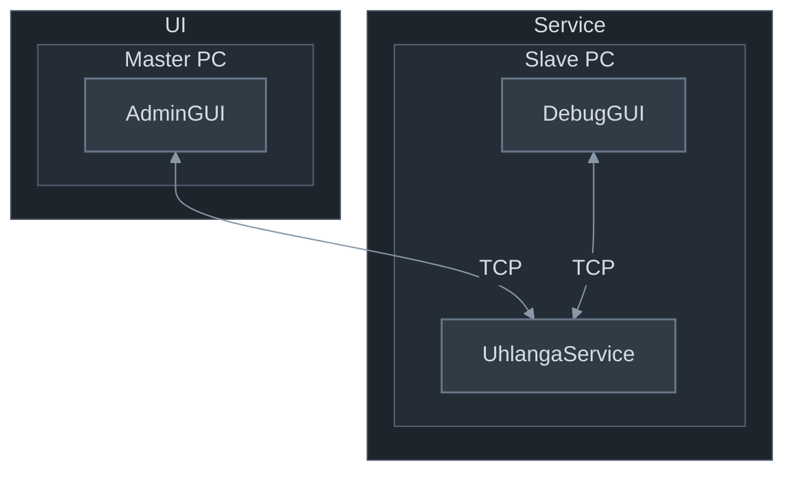

# Uhlanga System Architecture

```mermaid
%%{init: {"theme": "base", "themeVariables": {"darkMode": true, "background": "#171c22", "primaryColor": "#303b46", "primaryTextColor": "#d6dde4", "primaryBorderColor": "#657687", "secondaryColor": "#242c35", "tertiaryColor": "#1d242c", "lineColor": "#8998a7", "textColor": "#d6dde4", "clusterBkg": "#1d242c", "clusterBorder": "#465361", "edgeLabelBackground": "#242c35"}}}%%
flowchart TB
    subgraph UI["UI"]
        direction TB
        subgraph MasterPC["Master PC"]
            AdminGUI["AdminGUI"]
        end
    end

    subgraph Service["Service"]
        direction TB
        subgraph SlavePC["Slave PC"]
            UhlanageService["UhlangaService"]
            DebugMonitor["DebugGUI"]
        end
    end

    AdminGUI <-->|"TCP"| UhlanageService
    DebugMonitor <-->|"TCP"| UhlanageService

    classDef process fill:#303b46,stroke:#657687,color:#d6dde4,stroke-width:1.5px
    class AdminGUI,UhlanageService,DebugMonitor process
    style UI fill:#1d242c,stroke:#465361,color:#d6dde4
    style Service fill:#1d242c,stroke:#465361,color:#d6dde4
    style MasterPC fill:#242c35,stroke:#536272,color:#d6dde4
    style SlavePC fill:#242c35,stroke:#536272,color:#d6dde4
    linkStyle default stroke:#8998a7,color:#d6dde4
```
