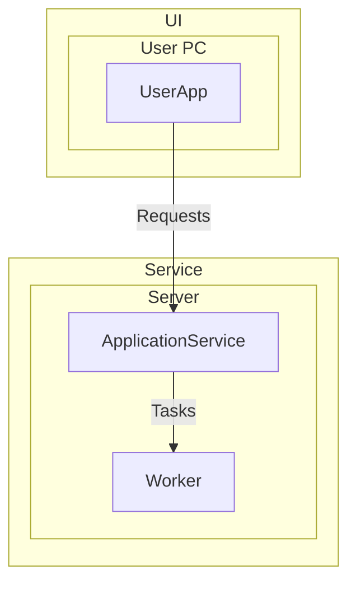

# System Architecture

Establish the relevant hardware architecture first, then build the software
architecture on it. Show which software components fulfill confirmed System
Requirements, where they execute, and how they communicate.

## Workflow

Author an architecture only when all SRs in the source documents are `confirmed`.

Read confirmed SRs, their Sub-SRs, existing architecture,
agreed terminology, and latest design decisions before designing. Separate
established choices from unresolved questions. Then follow this sequence:

1. Extract relevant hardware components. Identify execution hosts and interacting
   devices from requirements and explicit design decisions, establishing the
   hardware structure before assigning software. Keep unknown hardware choices
   open or clearly proposed.
2. Configure the software components that execute on each hardware component.
   Group responsibilities into meaningful process or service boundaries and
   place them on the hardware established in step 1. Do not invent software for
   hardware that has no relevant software responsibility.
3. Specify communication between software components. Show endpoints, direction,
   interaction purpose, and established or explicitly proposed protocols,
   distinguishing same-host and cross-host communication.
4. Divide the diagram into meaningful areas and arrange it for readability.
   Preserve hardware placement and communication semantics while grouping and
   positioning components; visual areas do not create new deployment boundaries.

The hardware-first procedure can produce one integrated diagram; separate
hardware and software diagrams are needed only when they improve understanding.

## Design Principles

- Group related responsibilities at a consistent level. One SR does not imply
  one process, service, class, or module. Several SRs may be implemented by one
  process. Split components when responsibilities, execution location, isolation,
  lifecycle, or an agreed interface justify a real boundary.
- Distinguish logical areas, physical or virtual hosts, executable processes,
  and internal modules. Use nested groups for host placement; do not present an
  internal function as an independently deployed process. Logical areas such as
  UI or Service are useful labels, not a mandatory layer scheme.
- Establish the hardware view at the component and deployment level. Show the
  execution hosts relevant to software deployment. Represent external
  devices or systems when software interacts with them; do not invent devices
  to fill an empty area. Hardware engineering details such as power and wiring
  are outside the default software architecture scope.
- Keep remote and same-host communication distinguishable through placement.
  Label important edges with direction and communication purpose; include a
  protocol when it is established or clearly identified as a design proposal.
  Bidirectional arrows mean communication in both directions, not merely that
  two components depend on one another. Do not assume TCP, HTTP, a message broker,
  or another technology solely to complete the diagram.
- Do not expand the overall diagram into classes,
  API endpoints, database schemas, or algorithms without a need at that level.
- When one host represents multiple instances, explain what repeats and which
  components connect to each instance. Do not infer instance counts, redundancy,
  or scaling policies from a representative drawing.

## Decisions

Make design proposals within confirmed requirements, distinguishing them from
existing agreements. A completed reference diagram reflects decisions for that project and
does not settle these choices for a new project.

Keep supported structure visible while questions remain. Record consequential
unresolved choices under `Pending Architecture Decisions`, with related
components and connections. Offer a candidate and rationale when useful,
clearly marking it as proposed.

Questions about product outcomes belong in UR, and questions about required
behavior or quality belong in SR. Identify those gaps without resolving them
through architecture assumptions or rewriting confirmed requirements. Mark
conflicting requirements or design decisions as `Conflict` and retain the
conflicting positions until resolved. Apply explicit answers across the diagram
and explanation, removing or revising resolved questions.

Preserve existing component names and IDs when updating an architecture.

## Output

Use the requested language and format. Preserve an existing format unless a
change is requested. For a new architecture, put a Mermaid `flowchart TB` after
the document title, showing the hardware structure with software placement and
communication:

- Use subgraphs for execution hosts, optionally grouped into meaningful logical
  areas. Place process nodes inside the hosts where they run. Distinguish any
  internal module view from this deployment view.
- Use stable Mermaid node identifiers and quoted labels containing only the
  component names. Omit SR source references from the diagram.
  Match names, host placement, and edge directions to the accompanying explanation.
- Label established protocols and important interaction purposes on edges.
  Keep external systems and devices outside the application's process boundary.
  Declare all connections at the bottom of the Mermaid block, after all
  component and subgraph declarations.
- Use readable visual distinctions between areas, hosts, and processes. Follow
  requested styling.

Use this example format for area → hardware → software nesting and communication.
Adapt names, component counts, placement, connections, and styling to the actual
design.

Immediately below the diagram, write a concise design summary explaining how
the architecture fulfills the SRs as a whole. Describe component responsibilities,
hardware selection and software placement rationale, main cooperation flows,
and structural choices supporting required qualities.
Cite related SR IDs in the explanation of component responsibilities,
interactions, and structural choices.

## Review

Review the diagram and design summary against the complete functional flows of
the confirmed SRs. Check that component responsibilities and interactions support
the required behaviors and qualities at the selected level.
Identify gaps or ambiguities as open questions.
Check actual process and host boundaries, interaction directions, representative
instances, and pending decisions. Verify Mermaid syntax and render
the diagram when a renderer is available; keep diagram and text consistent.

For a review request, report consequential findings with affected components
and suggest concrete improvements. Rewrite only when requested,
preserving agreed structure and requirement scope.
