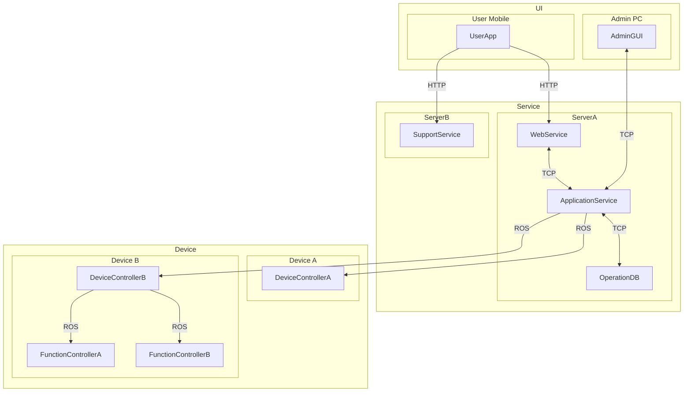

# System Architecture

Establish the relevant hardware architecture first, then build the software
architecture on it. Show which software components fulfill confirmed System
Requirements, where they execute, and how they communicate.

## Workflow

Before designing, check every requirement, including constraints, in every
source SR document. Proceed only when all are `confirmed`; Sub-SRs inherit the
parent state unless they have their own state. A `proposed`, missing, or unclear
state blocks the whole task. Apply the same check to any additional itemized
source input; unstructured source items require explicit user confirmation.
Report the source document and affected items and stop without writing an
architecture, selecting only confirmed items, drawing only supplied structure,
or automatically confirming inputs. Reference examples and the target
architecture being reviewed or revised are not upstream source documents.

Read confirmed SRs, their Sub-SRs, explicit constraints, existing architecture,
agreed terminology, and latest design decisions before designing. Separate
established choices from unresolved questions. Then follow this sequence:

1. Extract relevant hardware components. Identify execution hosts and interacting
   devices from requirements and explicit design decisions, establishing the
   hardware structure before assigning software. Keep unknown hardware choices
   open or clearly proposed.
2. Configure the software components that execute on each hardware component.
   Group responsibilities into meaningful process or service boundaries and
   place them on the hardware established in step 1. Do not invent software for
   hardware that has no relevant software responsibility.
3. Specify communication between software components. Show endpoints, direction,
   interaction purpose, and established or explicitly proposed protocols,
   distinguishing same-host and cross-host communication.
4. Divide the diagram into meaningful areas and arrange it for readability.
   Preserve hardware placement and communication semantics while grouping and
   positioning components; visual areas do not create new deployment boundaries.

Check requirement coverage and consistency between the diagram
and its explanation. Record unresolved design decisions as specific questions.
The hardware-first procedure can produce one integrated diagram; separate
hardware and software diagrams are needed only when they improve understanding.

## Design Principles

- Use in-scope `confirmed` SRs as requirement grounds, including their qualities
  and constraints. Any unconfirmed source item blocks the entire architecture
  task; proposed SRs cannot be deferred to allow partial design.
- Group related responsibilities at a consistent level. One SR does not imply
  one process, service, class, or module. Several SRs may be implemented by one
  process. Split components when responsibilities, execution location, isolation,
  lifecycle, or an agreed interface justify a real boundary.
- Distinguish logical areas, physical or virtual hosts, executable processes,
  and internal modules. Use nested groups for host placement; do not present an
  internal function as an independently deployed process. Logical areas such as
  UI or Service are useful labels, not a mandatory layer scheme.
- Establish the hardware view at the component and deployment level. Show the
  execution hosts relevant to software deployment. Represent external
  devices or systems when software interacts with them; do not invent devices
  to fill an empty area. Hardware engineering details such as power and wiring
  are outside the default software architecture scope.
- Keep remote and same-host communication distinguishable through placement.
  Label important edges with direction and communication purpose; include a
  protocol when it is established or clearly identified as a design proposal.
  Bidirectional arrows mean communication in both directions, not merely that
  two components depend on one another. Do not assume TCP, HTTP, a message broker,
  or another technology solely to complete the diagram.
- State each component's responsibility briefly outside the diagram.
  Do not copy the SR specification or expand the overall diagram into classes,
  API endpoints, database schemas, or algorithms without a need at that level.
  Explain quality-driven boundaries when they affect the structure.
- When one host represents multiple instances, explain what repeats and which
  components connect to each instance. Do not infer instance counts, redundancy,
  or scaling policies from a representative drawing.
- Preserve agreed supporting tools and explain their purpose and decision source.
  A developer monitor is not automatically a product requirement. Do not assign
  it an unrelated SR or add it merely because a reference example contains one.

## Decisions

Make design proposals within confirmed requirements, distinguishing them from
existing agreements. Architecture authoring permits proposing a structure; it
does not establish that the user accepted its deployment, protocol, or technology
choices. A completed reference diagram reflects decisions for that project and
does not settle these choices for a new project.

Keep supported structure visible while questions remain. Record consequential
unresolved choices under `Pending Architecture Decisions`, with related
components and connections. Offer a candidate and rationale when useful,
clearly marking it as proposed. An undecided protocol may be omitted from an edge
or labeled undecided; do not hide uncertainty behind a concrete technology.

Questions about product outcomes belong in UR, and questions about required
behavior or quality belong in SR. Identify those gaps without resolving them
through architecture assumptions or rewriting confirmed requirements. Mark
conflicting requirements or design decisions as `Conflict` and retain the
conflicting positions until resolved. Apply explicit answers across the diagram
and explanation, removing or revising resolved questions.

Preserve existing component names and IDs when updating an architecture.

## Output

Use the requested language and format. Preserve an existing format unless a
change is requested. For a new architecture, put a Mermaid `flowchart TB` after
the document title, showing the hardware structure with software placement and
communication:

- Use subgraphs for execution hosts, optionally grouped into meaningful logical
  areas. Place process nodes inside the hosts where they run. Distinguish any
  internal module view from this deployment view.
- Use stable Mermaid node identifiers and quoted labels containing only the
  component names. Explain responsibilities outside the diagram in concise
  prose or a list keyed by component name. Omit SR source references from the
  diagram and its explanation. Match names, host placement, and edge directions
  to the accompanying explanation.
- Label established protocols and important interaction purposes on edges.
  Keep external systems and devices outside the application's process boundary.
  Declare all connections at the bottom of the Mermaid block, after all
  component and subgraph declarations.
- Use readable visual distinctions between areas, hosts, and processes. Follow
  requested styling; a dark theme or a particular palette is not a design rule.

Use this example format for area → hardware → software nesting and communication.
Adapt names, component counts, placement, connections, and styling to the actual
design. All names below are template examples; replace them with project-specific
names. The areas, components, and protocols are illustrative choices, not
defaults. The unnamed controller group is only a layout aid.

Immediately below the diagram, write a concise design summary explaining how
the architecture fulfills the SRs as a whole:

- Explain which required capabilities or constraints call for the hardware
  shown and why software components are divided and placed as shown.
- Describe how components cooperate through the required functional flows,
  including result checks, transitions, recovery, and stopping where relevant.
  Make each required behavior's design support understandable without listing
  SR IDs, repeating the SR specification, or creating a mapping table.
- Explain structural choices needed to support required qualities and external
  constraints. Distinguish proposed design from implemented or verified behavior,
  and leave ambiguous SR behavior as questions rather than inventing it.

Use the summary for component responsibilities and necessary design rationale;
do not add a separate report or duplicate explanations. List consequential
unresolved architecture questions. Omit inapplicable areas without an `n/a` list.

The artifact contains architecture and its necessary explanation.

## Review

Review the diagram and design summary against the complete functional flows of
the confirmed SRs. Check that component responsibilities and interactions support
the required behaviors, qualities, and constraints at the selected level, without
requiring an SR ID mapping. Identify gaps or ambiguities as open questions, and
check that no excluded or proposed requirement has become an established capability.
Check actual process and host boundaries, interaction directions, representative
instances, and pending decisions. Verify Mermaid syntax and render
the diagram when a renderer is available; keep diagram and text consistent.

For a review request, report consequential findings with affected components
and suggest concrete improvements. Rewrite only when requested,
preserving agreed structure and requirement scope.
